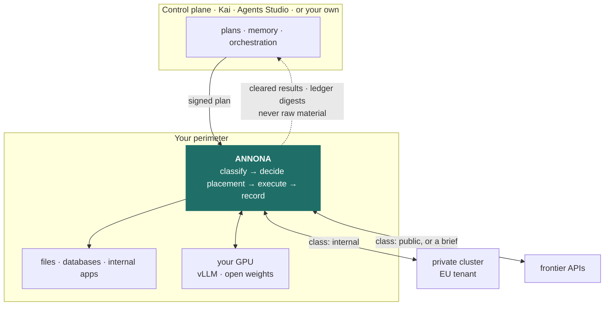
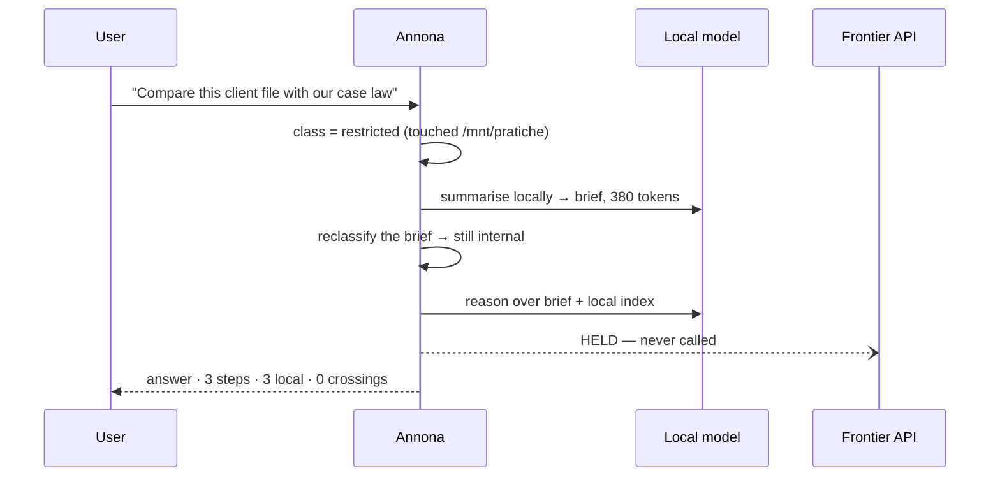
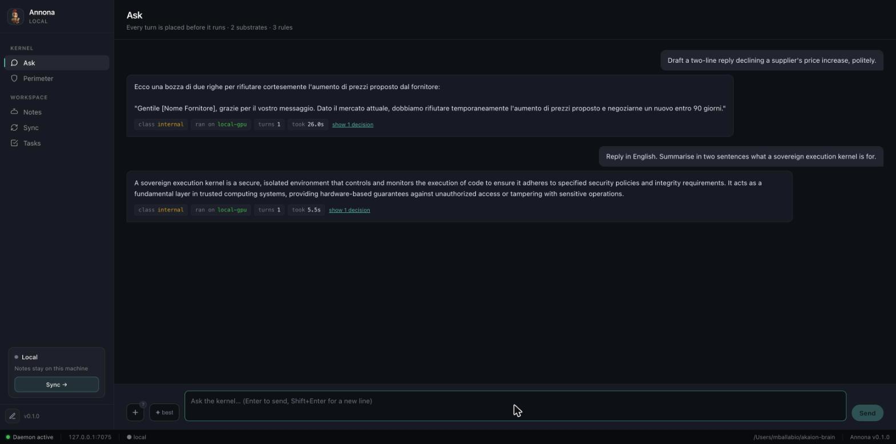
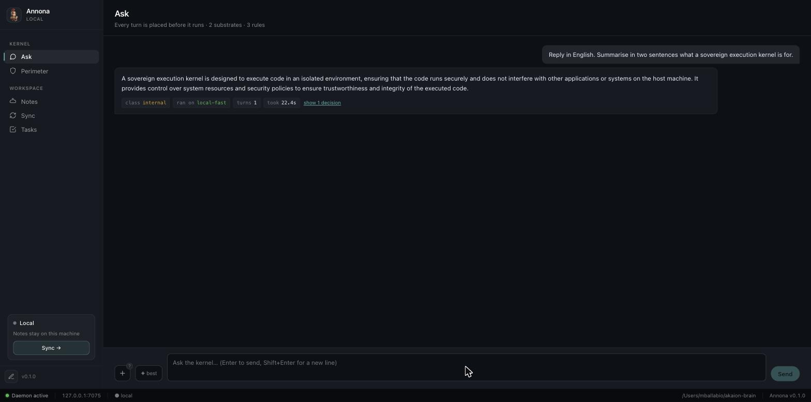
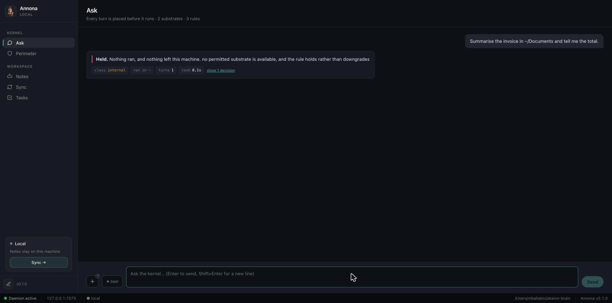
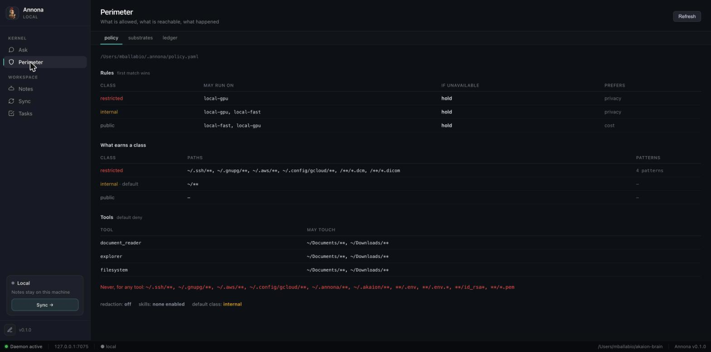
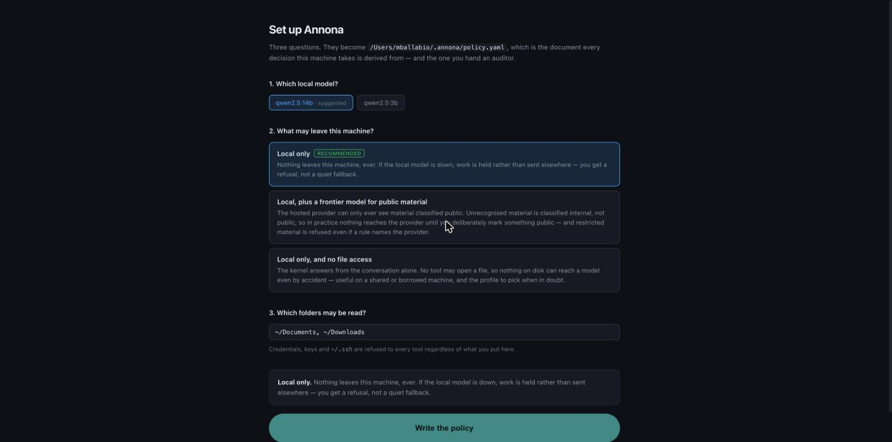

<div align="center">


# Annona

### The sovereign execution kernel for AI agents

**Where it runs is a decision — and the decision is yours, enforced and recorded.**


📐 **[Read the high-level design](docs/design/hld.md)** — components, the placement algorithm, the DGX appliance, the threat model, and the numbers it is judged by

[](https://github.com/akaion-ai/annona/releases/latest)
[](https://github.com/akaion-ai/annona/releases/latest)
[](https://github.com/akaion-ai/annona/releases/latest)

🌐 **[akaion-ai.github.io/annona](https://akaion-ai.github.io/annona/)** — the site · 🏛️ **[labs.akaion.com](https://labs.akaion.com)** — for companies · 🐳 `docker compose up -d` · 🐍 `pip install annona`

🐳 Container · 🖥️ CLI · 🧩 any OpenAI-compatible runtime — *an-NO-na*, the office that kept Rome fed

</div>

---

Rome imported its grain. Sicily, Africa, Egypt — the city could not feed itself,
and everyone knew what that meant: whoever controlled the ships controlled Rome.
So the Republic, and then the Empire, refused to leave it to the market. The
***cura annonae*** was a permanent office with a prefect at its head, and its job
was to decide **where the grain came from, which route it took, which granary
held it, and who received it** — and to keep the record of all four.

It was not built out of paranoia. It was built out of arithmetic: **a republic
cannot outsource what it cannot live without.**

Your organisation is now in that position with compute. Every agent you deploy
sends your material somewhere, and "somewhere" is currently decided by whichever
provider a developer typed into a config file eighteen months ago.

**Annona is the office.** It is a daemon you install where your data already
lives, and for every single step of every agent run it decides where that step is
allowed to execute, enforces the decision, and writes it down.

```
$ annona why step_7f3a
step_7f3a  inference  HELD
  class        restricted  (working set touched /mnt/pratiche/2026/BG-114.pdf)
  rule         rules[0]  restricted → [local-gpu], on_unavailable: hold
  candidates   local-gpu (unhealthy: connection refused since 14:02:11)
  not chosen   frontier — max_class public < restricted
               eu-cluster — max_class internal < restricted
  outcome      held at 14:03:07, queued for operator review
  ledger       #418  sha256:9c1f…a7  (chain verified)
```

That refusal is the product. A gateway in the same situation would have quietly
failed over to the frontier API and returned a good answer.

## The argument nobody was having

You have been told to pick one of three architectures: run models **on-prem**
(private, capped by your hardware), call **frontier APIs** (excellent, and your
material leaves), or run **your own weights in your own cloud** (a fine
compromise that costs you an MLOps team).

The industry argues about which column wins. That argument is the mistake.

> **The right column is a property of the request, not of the company.**

Summarising a public tender is not the same problem as reasoning over a client's
medical file, and the second does not become safe because procurement signed a
DPA. One organisation needs all three columns, chosen per step, ten thousand
times a day, by something that can prove afterwards what it chose.

Nothing in the stack does that:

| Layer | Examples | Decides | Cannot |
|---|---|---|---|
| Serving runtime | vLLM, Ollama, TensorRT-LLM | how fast one model answers on one box | anything about *which* box, or about tools |
| AI gateway | LiteLLM, Portkey, Envoy AI Gateway | which endpoint a token stream hits | execute a tool, read a file, classify material, prove anything |
| Agent framework | datapizza-ai, LangGraph | how you *write* an agent | placement — a config line, picked once |
| Sovereign models | Minerva, Velvet, Italia | which weights you may run in Europe | where a given request actually goes |
| **Annona** | — | **where each step runs, whether it may, and what crosses** | replace any of the above — it orchestrates them |

> **The claim, stated so you can falsify it.** Annona is the first open-source
> project in which the **placement of every inference and every tool call is a
> policy decision, enforced by the runtime and verifiable after the fact.** Find
> a project that does this and we will say so here.

## How it works



Annona is deliberately **not** the thing that decides *what* to do. Planning and
memory stay in the control plane — ours, or yours over three HTTP endpoints. The
component that touches your data is the one you can read, and it is small enough
to read. That is the entire trust argument.

Four rules give the picture its teeth:

**Fail closed.** No permitted substrate is available → the step is *held*. Not
downgraded, not rerouted, not "best effort".

**Failover may cost latency, money or model quality. Never jurisdiction.** This
is the one sentence that separates a kernel from a gateway with a fallback list.

**Contamination is monotone.** Once a transcript has touched restricted material
it stays restricted. Tools executing locally is *not* the same as data staying
local — the transcript is the leak, and it travels with the next inference.

**Outbound only.** No listening port on the internet. Nothing to firewall, no
inbound rule to request from a customer's IT department — historically the step
where sovereign deployments die.

## The same plan, two different verdicts

Ask it to compare a client file against your case law:



Now ask the same question about a public tender document. Steps 1 and 3 are
placed on the frontier model, the answer is better, and it costs a tenth as much.

**Same code. Same plan. Different policy verdict.** That is the product.

## What that looks like

Every answer carries where it ran and under which rule. Nothing is inferred from
a log afterwards — the decision is made before the step runs, and shown with it:



The same question under a policy that permits only the smaller model. Same code,
same plan, different placement — and the answer says so rather than leaving you
to wonder which model produced it:



And with nothing the policy permits available, the outcome the whole design is
for. Not a fallback, not a degraded answer from somewhere else:



The Perimeter view is the policy as the runtime reads it, which is not always
what somebody thinks they wrote:



## What it can actually do

The kernel decides placement; these are the things it places. All of it predates
the perimeter and none of it was dropped — what changed is that a tool the policy
does not name no longer runs.

| | |
|---|---|
| **Tools** | `document_reader`, `explorer`, `filesystem`, `shell`, `browser` — default-deny, per tool, per path |
| **Attachments** | drop a file into the window: documents, spreadsheets, XML and Italian **FatturaPA**, **signed `.p7m` envelopes**, email with attachments, archives, images, audio and video (transcribed locally), **DICOM**. Stored on your disk, classified before the first turn, read through the gated tool like anything else — [reference](docs/reference/attachments.md) |
| **Local vault** | every note a markdown file under `~/akaion-brain/`, indexed in SQLite: greppable, diffable, yours if you walk away |
| **Cloud sync** | one-way, opt-in, per note. `cloud.enabled: false` is the shipped default |
| **Desktop app** | Tauri shell for macOS, Windows and Linux over the same daemon |
| **Substrates** | Ollama, vLLM and any OpenAI-compatible `/v1`, Anthropic, a scripted offline backend |

The shipped policy enables the three read-only tools. `shell` and `browser` are
left off on purpose and the template says why: a shell has no path argument, so
enabling it is an all-or-nothing decision, and a browser reaches the network,
which is an egress this policy cannot yet classify.

## Skills, with a jurisdiction

A skill is what [Anthropic's Agent Skills](https://www.anthropic.com/news/skills)
are — a folder with a `SKILL.md`, front matter plus prose, loaded only when the
model asks for it. Same format on purpose: a skill written for one runtime still
works in the other.

Annona adds one field, and it is the only interesting part:

```yaml
---
name: image-report
description: Read one or more images and produce a structured, factual report.
requires: [vision]
tools: [document_reader, explorer]
pins: local          # ← the run is confined the moment this is loaded
---
```

`pins: local` is enforced by the kernel, not by a sentence at the bottom of the
instruction asking nicely. The moment the model loads that skill the working set
is restricted, and no later turn can be placed on a frontier API — whatever the
prompt looks like by then. **That is the difference between a prompt library and
a capability system.**

The shipped set is deliberately generic in name and specific in effect:

| Skill | What it does | Pinned |
|---|---|---|
| `image-report` | reads images and produces structured observations with explicit uncertainty and limits — radiology, damage claims, site photos, identity documents | local, needs vision |
| `document-triage` | sorts a folder by document type, extracts identifying fields, flags what needs a human | local |
| `case-timeline` | builds a dated chronology from a folder, with a source per line and conflicts named | local |
| `bulk-extract` | the same fields out of many documents into one table, misses reported rather than invented | local |
| `evidence-pack` | an answer plus everything needed to audit how it was reached | local |
| `redact-and-ask` | restates a question so it can be answered without the identifiers, then applies the answer here | — |
| `second-opinion` | answers, then attacks its own answer and reports where the two disagree | — |

```bash
annona skills                      # installed · allowed · usable here
annona skills --show image-report  # read the instruction yourself
```

### Claude's skills work here

The format is identical, so anything from
[`anthropics/skills`](https://github.com/anthropics/skills) — or anything you
already wrote for Claude Code — installs unchanged:

```bash
annona skills-install ~/Downloads/pdf          # a folder
annona skills-install pdf                      # or by name, from ~/.claude/skills
annona skills                                  # see what landed
```

Two things happen on the way in, and both are the point:

**An imported skill is pinned to the perimeter.** A skill is an instruction your
agent will follow — a supply-chain dependency that happens to be prose. One you
did not write runs inside your walls until you read it and say otherwise with
`--trust`. Provenance goes into the front matter; the body is copied byte for
byte, because silently editing somebody's instruction would be its own kind of
supply-chain problem.

**Installed is not enabled.** The policy still has to name it. Copying a file
into a directory is not a decision about what your agents may do.

Skills that bundle `scripts/` are copied whole and the install says so plainly:
those scripts will not run unless your policy allows the `shell` tool, which by
default it does not. The instructions still work; the automation in them does
not.

Skills are **default-deny** like tools: one that the policy does not name is
never offered, and asking for a disabled skill is answered exactly like asking
for one that does not exist. Your own live in `~/.annona/skills/` and override
the shipped ones by name, so a practice can encode its house style without
forking anything.

> `image-report` produces observations for a professional to interpret. It is not
> a diagnostic device, it does not conclude, and the instruction says so to the
> model as well as to you — software intended for diagnosis is regulated as a
> medical device, and calling it something else does not change that.

## Built on the Italian open-source stack

Annona is a kernel, not a monolith: it decides *where* work runs and delegates
everything else. Two of the three things it delegates to are Italian open-source
projects, and that is a choice rather than a coincidence — a sovereignty story
told with somebody else's entire stack is a slide, not an argument.

| | | |
|---|---|---|
| **[datapizza-ai](https://github.com/datapizza-labs/datapizza-ai)** | Datapizza Labs · MIT | the agent vocabulary underneath: message blocks, provider adapters, tool schemas. Annona builds on it rather than writing a fourth in-house framework — see [ADR 0001](docs/adr/0001-adopt-datapizza-ai.md) |
| **[rizzo-pii](https://github.com/Rizzo-AI-Academy/rizzo-pii)** | Simone Rizzo, Rizzo AI Academy · MIT | the redactor: 0.3B, CPU-only, 22 Italian categories including *codice fiscale*, *partita IVA* and cadastral identifiers that no other open model covers |
| **Annona** | Akaion AI Lab · Apache-2.0 | the kernel: where each step runs, whether it may, and the record that it did |

Neither is vendored. datapizza is a dependency with an ADR explaining the
choice; rizzo-pii is reached over its documented HTTP contract by an adapter in
`runner/capability/redactors/`, attributed in [`NOTICE`](NOTICE), and the
layering means the decision layer cannot import it even by accident.

The division of labour is clean, and it is the reason the two fit:

| | **rizzo-pii** | **Annona** |
|---|---|---|
| Answers | *what is an identifier?* | *may this cross, and where does it run?* |
| Is | a model | a kernel |
| Produces | redacted text + a local mapping | a decision, enforced, and a ledger entry |

Together they add a fourth answer to the three the perimeter already had. When a
step is too sensitive for every available substrate, instead of only *holding*
it, the policy can ask for **redaction**:

```yaml
redaction:
  provider: rizzo-pii
  endpoint: http://127.0.0.1:5005
  labels:                       # its 22 categories → your three classes
    CF: restricted
    PIVA: restricted
    CATASTO: restricted
    FULLNAME: internal
  on_error: hold                # a redactor that is down stops the step

rules:
  - match: { class: restricted }
    allow: [local-gpu]
    on_unavailable: redact      # replace the identifiers rather than refuse
```

```
Il Sig. Mario Rossi, C.F. RSSMRA85T10A562S, chiede una proroga.
  ↓  locally, by rizzo-pii
Il Sig. [FULLNAME_1], C.F. [CF_1], chiede una proroga.
  ↓  reclassified public → cleared → frontier model
Il Sig. [FULLNAME_1] ha tempo fino al 15 marzo.
  ↓  re-identified here, from a mapping that never left
Il Sig. Mario Rossi ha tempo fino al 15 marzo.
```

Three properties make this a control rather than a hope, and each is a test:

- **the redacted text is reclassified from scratch.** A redactor that missed an
  identifier produces text that merely *looks* safe; if anything is still there,
  the step is held. The redactor is the instrument, the perimeter is the
  authority.
- **a redactor outage holds the step** by default, because a control that
  disappears under stress is not a control.
- **the mapping never leaves the process** and never enters the ledger — the
  record says *two identifiers of kind CF and FULLNAME were replaced*, and
  nothing more.

> **Pseudonymous is not anonymous.** Under GDPR, replacing a name with a stable
> token leaves personal data: the mapping exists and re-identification is
> possible by design. This reduces exposure, it does not remove the need for a
> lawful basis, and Annona says so rather than implying otherwise.

Any redactor satisfying the same small protocol can be wired in its place — the
policy names a provider, and the decision layer never learns which one.

## Get it

### The desktop app

| | | |
|---|---|---|
| **Windows** | per-user installer, no admin rights | [`Annona_*_x64-setup.exe`](https://github.com/akaion-ai/annona/releases/latest) |
| **macOS** | Apple Silicon and Intel | [`Annona_*.dmg`](https://github.com/akaion-ai/annona/releases/latest) |
| **Linux** | portable — `chmod +x` and run | [`Annona_*.AppImage`](https://github.com/akaion-ai/annona/releases/latest) |

A tagged release builds all four targets and publishes a GitHub Release with the
bundles attached. They are **unsigned during beta**, and on macOS that is not a
dialog you can click through: since macOS 15 an un-notarised app that carries a
quarantine flag is reported as damaged and **moved to the Trash**. Clear the flag
on the disk image before opening it —

```bash
xattr -dr com.apple.quarantine ~/Downloads/Annona_*.dmg
```

— and drag it in as usual. On Windows, SmartScreen → **More info** → **Run
anyway**. Full detail, and the two routes that avoid this entirely, in
[Install](https://akaion-ai.github.io/annona/getting-started/install/).

The app is the same daemon with a window around it — the CLI, the policy and the
ledger are identical.

On first launch it asks the three questions the policy answers, rather than
defaulting silently and leaving you to find `policy.yaml` later:



Each option says what it *means* rather than what it sets, because "adds a
substrate capped at public" describes YAML and "the hosted provider can only ever
see material classified public" is what somebody is agreeing to. `annona setup`
asks the same three in a terminal, from the same profiles.

### From source, in sixty seconds

```bash
git clone git@github.com:akaion-ai/annona.git
cd annona
make setup          # venv + dependencies
make demo           # a real agentic run — no credentials, no network
```

`make demo` is the fastest way to understand this repository. It drives a **real
agentic loop** — real tool execution against real files, real policy checks —
from a scripted backend, so it needs no API key and opens no socket. It shows one
task the policy permits and one it refuses:

```
1 · a task the policy permits
  1. ok      explorer         {'operation': 'map', 'path': '…/documents'}
  2. ok      document_reader  {'path': '…/reports/q1_report.txt'}
     answer  Q1 2026: 142 pratiche aperte, 98 chiuse, 412.000 EUR…

2 · a task the policy refuses
  1. denied  filesystem       {'operation': 'read', 'path': '~/.ssh/id_rsa'}
     → {'error': 'Permission denied for tool: filesystem'}
```

Nothing left the process. The same run is a CI gate on every push
(`python -m runner.demo --check`), so that claim cannot rot.

Then:

```bash
annona setup        # the policy, in three questions — or --yes for the defaults
annona doctor       # check this machine can actually run a step
make run            # daemon + local UI on 127.0.0.1:7070
```

No account required, ever. `annona doctor` is the one to run when something is
wrong: it names what is missing, including the case a liveness probe cannot see —
a runtime that is up with the model your policy names not pulled.

### As an appliance, with a real model

```bash
docker compose up -d                                   # kernel + Ollama, arm64 or amd64
docker compose exec annona-ollama ollama pull qwen2.5:14b
docker compose exec annona annona setup --yes --endpoint http://ollama:11434 --model qwen2.5:14b
make verify                                            # the acceptance run
```

`make verify` plants a canary in a client file, lets a real agent read it, and
checks the nine things a customer's auditor would:

```
  pass  the local runtime answers
  pass  the model called the tool
  pass  reading a client file made the run restricted
  pass  no payload reached the frontier substrate
  pass  leak rate is zero
  pass  every inference was placed on-prem
  pass  the ledger chain verifies
  pass  the run produced an answer
  pass  with the GPU down, restricted work is held (not rerouted)
```

The last check is the commercial one. Deployment, sizing and the DGX Spark
specifics are in [`deploy/README.md`](deploy/README.md).

### Operating it

```bash
annona policy show             # the policy as the runtime understands it
annona policy test restricted  # where would restricted work go, right now?
annona substrates              # what is registered, where, and whether it is up
annona why step_7f3a           # reconstruct one decision from the ledger
annona verify                  # check the chain, offline, contacting nobody
annona audit --held            # every refusal, with its reason
```

## The policy is a file you own

```yaml
# ~/.annona/policy.yaml
classes:
  restricted:                      # never leaves the walls
    paths:    ["/mnt/pratiche/**", "~/clienti/**"]
    patterns: ['[A-Z]{6}\d{2}[A-Z]\d{2}[A-Z]\d{3}[A-Z]']    # codice fiscale
  internal:
    paths:    ["~/Documents/**"]
  public:
    default: true

rules:
  - match: { class: restricted }
    allow: [local-gpu]
    on_unavailable: hold           # the whole point. No silent downgrade.
  - match: { class: internal }
    allow: [local-gpu, eu-cluster]
    on_unavailable: queue
  - match: { class: public }
    allow: [local-gpu, eu-cluster, frontier]
    prefer: cost
```

A DPO can read that in one sitting, which is the design constraint. Full schema,
placement algorithm and the state machine behind it:
**[`docs/design/hld.md`](docs/design/hld.md)**.

You can edit it in your editor, or in the app under **Perimeter → Edit**. Being
editable from a window is a real widening of what that surface can do, so three
things hold it up: the replacement is **parsed before it is written** (a policy
that does not load would stop enforcement, and this must not be able to cause
that), the previous file is **always copied aside**, and every change is
**appended to the same hash-chained ledger as the decisions**.

That last one is what makes it defensible rather than merely convenient — widen
the perimeter, run something, narrow it back, and the record reads:


A pairing token does **not** grant this. Pairing lets a web app run steps here;
an origin that could also rewrite the policy would hold every permission the
perimeter exists to withhold, so the write routes refuse anything but this
machine.

## Where it runs

Three topologies, **one binary, one release**. They differ in configuration —
which substrates are registered and what the policy permits — never in code. A
fork per deployment is how sovereignty claims rot, so there isn't one.

| | **Detached** | **Attached** | **Appliance** |
|---|---|---|---|
| Hardware | laptop, Mac mini in a cupboard | any server | DGX-class, or EU colocation |
| Control plane | none — local plans and CLI | Agents Studio, outbound only | Agents Studio |
| Inference | local runtime only | local + remote, by policy | local (vLLM), remote by exception |
| Users | one | one | many, per-user policy |
| Network | may be fully air-gapped | outbound 443 only | outbound 443 only |

Detached means detached: no account, no remote host, no outbound connection at
all. It is the configuration we expect a fork to start from.

On a **DGX Spark** the appliance runs Annona and vLLM under one compose file
(`--profile vllm`), with the daemon unprivileged and only vLLM touching the GPU.
Two things appliance vendors usually skip, stated up front: every image must be
`linux/arm64` + CUDA 13 — x86 images silently do not run on a GB10, so the
release matrix builds and tests both — and the real ceiling is memory bandwidth,
not the 128 GB. See [`deploy/README.md`](deploy/README.md) and
[HLD §7.2](docs/design/hld.md#72-the-appliance-on-a-dgx-spark), including what
GPU attestation does *not* buy you on that hardware.

## What is built, and what is not

This project publishes its gaps, because a perimeter you cannot verify is a
slogan.

**Built and under test.** Classification (paths, symlink targets, content
patterns, and paths named in a prompt), the monotone working set, a default-deny
tool gate, the placement engine with its conformance matrix, substrate health
with a circuit breaker, failover that cannot widen the permitted set, locally
produced briefs that are reclassified before they may cross, a hash-chained
ledger with `verify` / `why` / `audit`, an arm64 + amd64 container image, and a
nine-check acceptance run for a new appliance.

```
$ make contracts
L0 kernel does not depend on outer layers                    KEPT
L3 agent depends only inward on L0                           KEPT
L3 agent and L1 capability do not know about each other      KEPT
L0 kernel imports no provider SDK                            KEPT
L3 agent loop imports no provider SDK                        KEPT
L2 policy depends only inward on L0                          KEPT
L2 placement depends on policy and the kernel, never outward KEPT
L2 audit depends on nothing but the kernel                   KEPT
L2 policy, placement and audit cannot reach an L1 adapter    KEPT
L2 imports no provider SDK                                   KEPT
```

The last four are why "failover cannot widen the permitted set" is structural: a
shortcut from the decision layer to an adapter is not a code review away, it is
a build failure.

**Not built.** Stated as plainly as the rest:

| Gap | Today | Phase |
|---|---|---|
| **Grammar-constrained tool calls** | small models are asked politely; malformed arguments become a tool error the model can retry from | F1 — the research claim |
| **The ledger has no external anchor** | tamper-evident against edits, deletions and reordering; a chain rebuilt wholesale by someone with write access is not detectable | F3 |
| **Queued steps are not resumed automatically** | `on_unavailable: queue` records the decision; retrying is manual | F2 |
| **The legacy config path is still allow-by-default** | an installation without a policy keeps the old permission manager; `annona policy init` is what switches it | F1 |
| **Vault metadata is not portable** | markdown holds the body; titles, tags and sync state live only in SQLite | F3 |
| **No measured leak rate at scale** | zero over the acceptance corpus and the live model tests; the 1 000-step number is not run yet | F2 |

Each has a metric and a target rather than a promise —
[HLD §9](docs/design/hld.md#9-verification-the-numbers-this-design-lives-or-dies-by)
and [`docs/research/index.md`](docs/research/index.md), where negative results get
published too.

## The trust boundary

Annona is open source on purpose. It is the component that sees your material, so
it must be the component you can audit — and replace.

| | **Annona** (this repo, Apache-2.0) | **Agents Studio** (hosted, proprietary) |
|---|---|---|
| Decides *what* to do | no | yes — plans, versions, fleet |
| Decides *whether it may*, and *where* | **yes, and it is the only one that does** | no |
| Sees raw material | yes, and does not let it leave | never |
| Runs where | your machine, your rack, your appliance | EU cloud |

Point it at your own backend by implementing three endpoints — verify a token,
receive pushed notes, optionally serve inference — or set `ai.provider: local`
and skip the third entirely. Details in
[the trust boundary section of the HLD](docs/design/hld.md#6-control-plane--data-plane-contract).

## Documentation

| | |
|---|---|
| [**High-level design**](docs/design/hld.md) | the design of record: components, placement algorithm, DGX appliance, threat model, metrics, acceptance run |
| [Architecture as built](docs/design/architecture.md) | only the code that exists today |
| [Sovereign runtime](docs/design/sovereign-runtime.md) | the threat model in full |
| [Research](docs/research/index.md) | what we are trying to prove, and the numbers |
| [Turning the perimeter on](docs/getting-started/perimeter.md) | five minutes from install to watching it refuse |
| [Skills](docs/skills.md) | the format, the pin, installing Claude's, writing your own |
| [Deploying](deploy/README.md) | laptop, DGX Spark, your own tenant — and the acceptance run |
| [Decisions](docs/adr/index.md) | why it is shaped this way, including the ones we reversed |
| [Casi d'uso](docs/casi-duso.md) 🇮🇹 | the one-pager for the Italian market: what it solves, for whom, and the test behind each claim |

## Contributing

```bash
make check            # lint · types · contracts · tests — exactly what CI runs
make docs-serve       # documentation at 127.0.0.1:8000
make                  # list every target
```

Two things worth knowing before your first PR:

- **Do not mock a vendor SDK in tests.** Use the `echo` backend and drive the loop
  through its ports — see `tests/test_agent_loop_unified.py`.
- **If you touch the trust boundary** — permissions, placement, egress, the
  ledger — say in the PR description what a reviewer should check to convince
  themselves the boundary still holds. Not "I tested it": *what to look at*.

[`CONTRIBUTING.md`](CONTRIBUTING.md) · [`SECURITY.md`](SECURITY.md) ·
[`CHANGELOG.md`](CHANGELOG.md)

The Firebase Web API key in `auth.py` is the project's documented public default;
Firebase Web SDK keys are designed to be client-visible.

---

<div align="center">

**Annona** is built by [**Akaion AI Lab**](https://akaion.com) on
[datapizza-ai](https://github.com/datapizza-labs/datapizza-ai) (MIT), because the
world does not need a fourth agent framework — it needs the part underneath.

Apache 2.0 · [`LICENSE`](LICENSE) · [`NOTICE`](NOTICE) · Copyright 2026 Akaion

</div>

---

**Deploying this in an organisation?** [labs.akaion.com](https://labs.akaion.com) —
the kernel is open and always will be. What a company usually wants alongside it
is the policy written against their own folders, the hardware, and somebody who
answers when it breaks.
