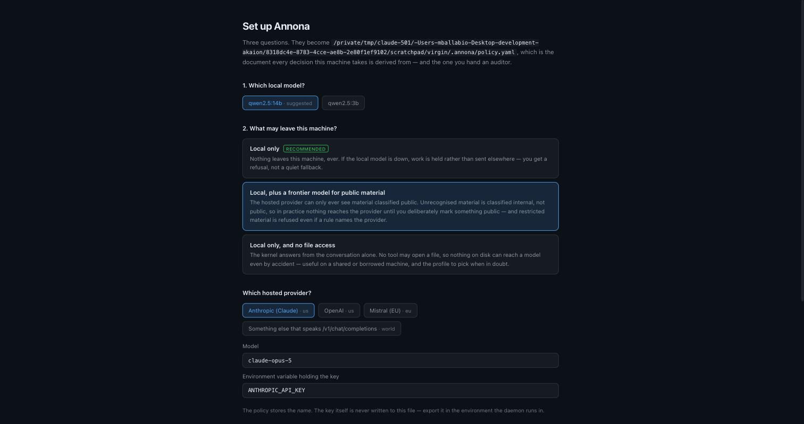
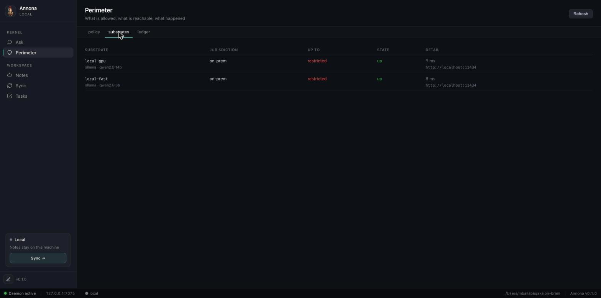

# Install Annona

Annona ships as two things, and you can have either or both:

| | What it is | Install |
|---|---|---|
| **The app** | A window: ask the kernel things, watch it decide, read the ledger. Carries its own daemon — nothing else to install. | [Download a build](#the-app) |
| **The CLI** | `annona` — the same kernel from a terminal, plus the daemon, the policy tools and the ledger checks. No window. | `pip install annona` |

Both read the same `~/.annona/policy.yaml` and write the same ledger. Installing
one does not stop the other from working.

!!! warning "Beta, and unsigned"
    The macOS and Windows builds are **not signed by a recognised developer**.
    Notarisation needs a paid Apple certificate this project does not yet use,
    and saying so here is better than letting you find out from a dialog. On
    macOS this has a concrete consequence and a concrete fix — see
    [macOS](#macos), and read it before double-clicking anything.

---

## The app

Builds for every platform are on the
[releases page](https://github.com/akaion-ai/annona/releases/latest).

| Platform | File |
|---|---|
| macOS, Apple Silicon (M-series) | `Annona_<version>_aarch64.dmg` |
| macOS, Intel | `Annona_<version>_x64.dmg` |
| Windows | `Annona_<version>_x64-setup.exe` |
| Linux | `Annona_<version>_amd64.AppImage` or `annona_<version>_amd64.deb` |

### macOS

Because the app is unsigned, macOS quarantines it on download. On **macOS 15 and
later this is not a dialog you can click through**: the system reports the app as
damaged and moves it to the Trash, and the old right-click → *Open* escape route
no longer exists.

So clear the quarantine flag on the **disk image, before opening it**:

```bash
xattr -dr com.apple.quarantine ~/Downloads/Annona_*.dmg
```

Then open the `.dmg` and drag **Annona** to Applications as usual. The app has no
quarantine flag to inherit, and launches normally from then on.

That command removes the marker macOS puts on downloaded files. You are telling
your machine you trust this file — which is a real decision, so it is yours to
make rather than something an installer does quietly. If you would rather not:
`pip install annona` needs none of this, and building from source needs none of
it either.

More detail, including how to tell "unsigned" apart from "actually corrupt", is
in [Opening it on macOS](macos-gatekeeper.md).

### Windows

Run the `.exe`. SmartScreen will warn that the publisher is unknown: **More
info** → **Run anyway**.

### Linux

```bash
chmod +x Annona_*.AppImage
./Annona_*.AppImage
```

Or with the `.deb`:

```bash
sudo dpkg -i annona_*_amd64.deb
```

---

## The CLI

```bash
pip install annona
```

Python 3.10 or newer. This installs three console scripts — `annona`, and the
aliases `dogana` and `akaion` — plus the daemon and every policy and ledger
command.

The wheel **does not contain the window**. `pip install annona` gives you the
kernel, the CLI and the local API; the interface lives in the desktop bundles.
Starting the daemon from a pip install and opening `http://127.0.0.1:7070` gets
you a 404, and that is expected rather than broken.

Optional extras, none of which are needed to run:

```bash
pip install 'annona[formats]'    # .pptx, .p7m, Outlook .msg, HEIC photos
pip install 'annona[providers]'  # SDKs for hosted models, if your policy names one
```

## From source

```bash
git clone https://github.com/akaion-ai/annona.git
cd annona
make setup
```

`make setup` creates the virtual environment and installs everything, including
the development tools. `make demo` then runs a real agentic loop with real tool
execution, no credentials and no network — the fastest way to see what the
repository actually does.

---

## First run

Annona needs a **policy** before it can answer anything. The policy is the
document every decision derives from: which model runs what, what may leave this
machine, which folders a tool may open. Without one the daemon starts, says it is
not enforcing, and refuses to place anything.

You are asked for it once, in three questions. Both the app and the CLI ask the
same three, from the same profiles.

### In the app

The first launch opens the configurator instead of the app:


Each option says what it *means* rather than what it sets. "Local only" is the
recommended answer and the one most installs should keep: nothing leaves the
machine, and if the local model is down your work is held rather than quietly
sent somewhere else.

Choosing the second profile asks which hosted provider, and where its key lives:



The policy stores the **name** of the environment variable, never the key. A
policy file is the document you hand an auditor, and a key in it is a key in a
git history.

### In the terminal

```console
$ annona setup

🛡️  Annona setup

  config    written /Users/you/.akaion/config.yaml

1. Which local model?

  1  qwen2.5:14b  ← suggested
  2  qwen2.5:3b

  Number [1]:

2. What may leave this machine?

  1  Local only  (recommended)
      Nothing leaves this machine, ever. If the local model is down, work is
      held rather than sent elsewhere — you get a refusal, not a quiet fallback.

  2  Local, plus a frontier model for public material
      The hosted provider can only ever see material classified public…

  3  Local only, and no file access
      The kernel answers from the conversation alone…
```

`annona setup` is safe to run twice: it never overwrites a policy that exists.
For scripts and containers there is nothing to answer —

```bash
annona setup --yes                          # defaults, no questions
annona setup --profile local-only --model qwen2.5:14b
```

— and it asks nothing when there is no terminal, so a provisioning run cannot
hang on a prompt.

### You need a local model

The default profiles run on [Ollama](https://ollama.com). Install it, then pull
a model — 14b if the machine can hold it, 3b if not:

```bash
ollama pull qwen2.5:14b
```

Setup registers whichever model you already have rather than insisting on one,
and tells you what to pull if you have none.

---

## Check it works

```console
$ annona doctor

 ✓   python              3.12.13
 ✓   config              /Users/you/.akaion/config.yaml
 ✓   policy              /Users/you/.annona/policy.yaml · 1 substrate(s), 3 rule(s)
 ✓   substrate local-gpu up at http://localhost:11434 · qwen2.5:14b · 2 model(s)
 ✓   ledger              0 entries · chain intact · 0 gaps
 ✓   daemon              127.0.0.1:7070 · responding

✅ Ready.
```

`doctor` changes nothing, contacts nothing except the substrates your policy
already names, and exits 1 if the installation cannot run a step — so it can be
the last line of a provisioning script.

It checks one thing the daemon's own liveness probe cannot: whether the model
your policy names is actually **pulled**. A runtime that is up with that model
missing looks perfectly healthy to a liveness check, places the step, and then
fails from the far side of a decision already written to the ledger as `placed`.

```
 ✗   substrate local-gpu up, but qwen2.5:14b is not pulled (has: qwen2.5:3b)

  substrate local-gpu: ollama pull qwen2.5:14b
```

## Start it

```bash
annona run                # daemon + local interface on 127.0.0.1:7070
annona run --port 7075    # somewhere else
```

The app starts its own daemon; you do not need this if you are using the window.

---

## What it looks like working

Every answer carries where it ran and under which rule:


The same question under a policy that allows only the smaller model — same
kernel, different placement, and the answer says so:


And when nothing the policy permits is available, the honest outcome:


That is the behaviour to check on your own machine before trusting anything
else: stop your local model, ask something, and confirm you get a refusal rather
than an answer from somewhere you did not choose.

The Perimeter view shows what the policy allows, as the runtime reads it —
not as it is written:


…which substrates are registered and whether they answer:



---

## Uninstall

**The app.** Drag `Annona.app` to the Trash (macOS), uninstall from Settings
(Windows), or delete the AppImage / `sudo dpkg -r annona` (Linux).

**The CLI.** `pip uninstall annona`

**Your data.** Neither of those touches it. The policy, the ledger and the vault
are yours, and they stay:

```
~/.annona/policy.yaml     the policy
~/.annona/ledger.jsonl    every decision this machine took
~/.akaion/config.yaml     daemon settings
~/akaion-brain/           the vault, as plain markdown
```

Delete them yourself when you want them gone. The ledger in particular is the
record of what was decided and refused; a program that removed it during an
uninstall would be removing the evidence that it behaved.

---

## Troubleshooting

**`annona: command not found` after `pip install`** — the scripts went somewhere
not on your `PATH`. `python3 -m runner.cli --help` works regardless (the
distribution is `annona`, the Python package inside it is `runner`), and
`python3 -m site --user-base` tells you which `bin` to add.

**The window says the daemon is unreachable** — run `annona doctor`. If it says
the daemon is not running, the app's own daemon failed to start; the log is at
`~/.annona/logs/annona.log`.

**Opening `127.0.0.1:7070` gives a 404** — you are running the daemon from a
`pip install`, which does not carry the window. Expected; use the app bundle.

**macOS moved the app to the Trash** — the quarantine flag; see
[macOS](#macos) above.
