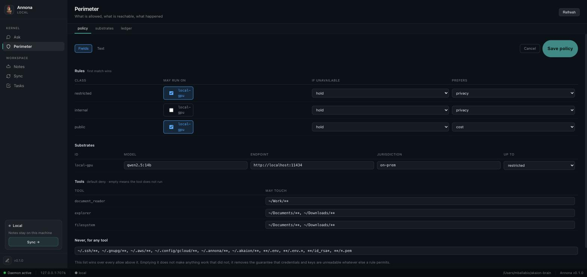
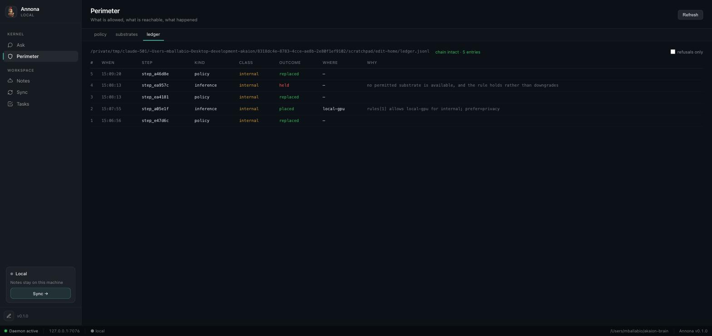

# Turning the perimeter on

Five minutes, on the machine you already have. At the end, a run that reads a
client file cannot be placed on a frontier API — and you will have watched it
refuse.

Nothing here needs a GPU, a DGX, or an account.

---

## 1 · Write a policy

```bash
annona setup            # three questions, then both files
```

Or `annona policy init --model qwen2.5:14b` if you only want the policy and
already have a configuration.

That writes `~/.annona/policy.yaml` and changes the daemon's behaviour in one
way that matters: **from this point tools are default-deny**. An installation
without a policy keeps the legacy allow-by-default permission manager, so
upgrading does not silently break a working machine; writing a policy is the act
that switches enforcement on.

The shipped policy registers **only your local runtime**. Nothing can leave the
machine because nothing outside it is declared.

```bash
annona policy show        # the policy as the runtime understands it
annona policy validate    # exit code 1 if it does not load
```

## 2 · Check what is up

```bash
annona substrates
```

| id | jurisdiction | max class | health |
|---|---|---|---|
| local-gpu | on-prem | restricted | **up** · 12 ms |

If it says `down`, start the model server (`ollama serve`) — or leave it down for
a minute, because that is the interesting case.

## 3 · Ask where work would go, before running any

```bash
annona policy test restricted --probe
annona policy test public --probe
```

This is the command to run before a change goes live rather than after an
incident: it answers *"if this were restricted, where would it go?"* without
needing restricted material to try it with.

With the local runtime down, the first one answers `held` and names every
substrate it did not choose, with the reason.

## 4 · Add somewhere else to go

Placement only becomes interesting when there is more than one option. Add a
second substrate and a rule that allows it — deliberately, because this is the
line where material can start leaving:

```yaml
substrates:
  - id: local-gpu
    kind: ollama
    endpoint: http://localhost:11434
    model: qwen2.5:14b
    jurisdiction: on-prem
    max_class: restricted      # may see anything
    probe: true

  - id: frontier
    kind: anthropic
    jurisdiction: us
    max_class: public          # may see only what is public
    quality: 98

rules:
  - match: { class: restricted }
    allow: [local-gpu]
    on_unavailable: hold       # the whole point: no silent downgrade

  - match: { class: public }
    allow: [frontier, local-gpu]
    prefer: quality
```

`max_class` is the field everything turns on. It is declared per substrate rather
than derived from `jurisdiction`, so you can be stricter than geography — an EU
cluster you do not control can be capped at `public` even though it is in the EU.

## 5 · Say what is sensitive

```yaml
classes:
  restricted:
    paths:    ["/mnt/pratiche/**", "~/clienti/**"]
    patterns: ['[A-Z]{6}\d{2}[A-Z]\d{2}[A-Z]\d{3}[A-Z]']   # codice fiscale
  internal:
    paths:    ["~/Documents/**"]
  public:
    default: true
```

Paths are matched both literally and resolved, so a symlink out of a protected
directory is classified by its target. Patterns are matched against content *and*
against anything a prompt names — pasting a tax code into a question is enough.

## 6 · Watch it refuse

```bash
make verify        # or: python deploy/verify_appliance.py --model qwen2.5:14b
```

Nine checks in about twenty-five seconds. It plants a canary in a client file,
lets a real local model read it, and asserts the things an auditor would:

```
  pass  reading a client file made the run restricted
  pass  no payload reached the frontier substrate
  pass  leak rate is zero
  pass  the ledger chain verifies
  pass  with the GPU down, restricted work is held (not rerouted)
```

## 7 · Read the record

Every decision — including every refusal — is in a hash-chained ledger you can
check without contacting anyone.

```bash
annona audit              # placements, outcomes, classes
annona audit --held       # every refusal, with its reason
annona verify             # the chain, offline
annona why step_7f3a      # one decision, reconstructed
```

---

## Changing it later

`policy.yaml` is a file you own, and editing it in your editor is still the most
direct way. The app can do it too — **Perimeter → Edit**:



The fields cover what the tables show. **Text** mode edits the file itself, and
is the only way to change something the fields do not cover — or to keep comments
you wrote inside the body, which a structured save would rewrite away. The editor
switches to it on its own when it finds such comments, rather than offering a
save that deletes them.

Three things hold that up, and they are worth knowing because they are what make
an editable perimeter defensible rather than merely convenient:

- **Nothing invalid reaches disk.** The replacement is parsed before it is
  written, by the same loader the daemon uses. A policy that does not load would
  stop enforcement, and this is the one failure the editor must not cause.
- **Nothing is lost.** The previous file is copied to `policy.yaml.bak-<n>`
  beside it, every time.
- **Nothing is quiet.** Every change is appended to the same hash-chained ledger
  as the decisions.

That last one is the point. A perimeter you can widen is only trustworthy if
widening it is on the record next to what ran afterwards:



Read as: the perimeter was changed, something ran on the local GPU, the perimeter
was narrowed, the next run was **held**, and the perimeter was changed again.
Five entries, chain intact. `annona audit` shows the same from a terminal.

A change takes effect on the **next run** — the policy is read per run, so
nothing needs restarting.

## What to do next

- **Turn on skills** — `annona skills`, then name the ones you want in the
  policy. See [Skills](../skills.md).
- **Add redaction** — a local PII model lets a restricted question be answered
  by a frontier model without the identifiers. See the README section on the
  Italian open-source stack.
- **Put it in a container** — `docker compose up -d`, and on DGX-class hardware
  the `vllm` profile. See [Deploying](https://github.com/akaion-ai/annona/blob/main/deploy/README.md).

## Two things people hit

**"My tools stopped working."** They did: the policy is default-deny and only
names `document_reader`, `explorer` and `filesystem` for two directories. Add
what you need, with paths. `shell` and `browser` are deliberately absent —
a shell has no path argument, so allowing it is all-or-nothing, and a browser
reaches a network this policy cannot yet classify.

**"Everything is held."** Usually one of two things: no rule covers the class
(no rule means deny), or the only permitted substrate is down. `annona why` on
the step id says which, in words, with the candidates it considered.
